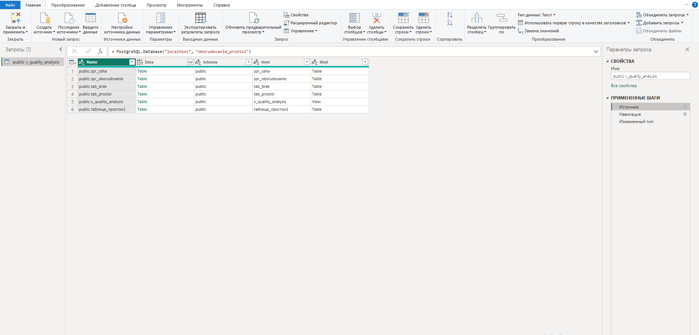
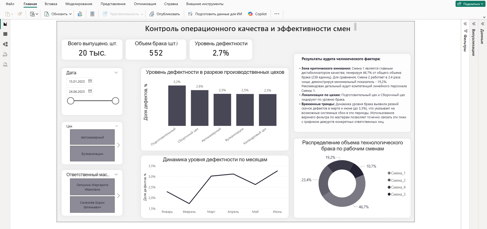
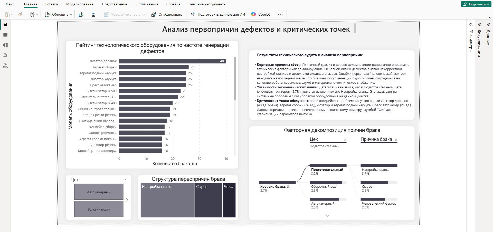

# Дашборд комплексного анализа технологического брака и эффективности смен (PostgreSQL + Power BI)

## 📌 Описание проекта
Данный проект представляет собой интерактивный двухстраничный аналитический дашборд в Power BI, разработанный для службы контроля качества (ОТК) и производственного менеджмента. 

**Цель проекта:** Локализовать источники возникновения брака, оценить эффективность работы производственных смен и выявить корневые инженерно-технические причины дефектов (Root Cause Analysis).

Проект выполнен по принципу End-to-End решений: от проектирования структуры в реляционной СУБД PostgreSQL до финальной бизнес-визуализации.

---

## 🛠 Технический стек и архитектура решения

* **База данных и СУБД:** PostgreSQL (работа через DBeaver / MySQL Workbench). Исходные таблицы были импортированы в базу, после чего на стороне СУБД было создано аналитическое представление (SQL View). Это позволило перенести логику объединения данных (JOIN) на уровень сервера и реализовать принцип **Query / Data Folding**.
* **Бизнес-аналитика:** Power BI Desktop с прямым подключением к PostgreSQL View.
* **Моделирование и оптимизация:** Модель данных внутри Power BI сделана предельно легкой (одна плоская витрина), так как вся сборка данных выполнена на стороне БД. Внутри написаны базовые DAX-меры для расчета уровня дефектности (Defect Rate), динамически пересчитываемые в любом контексте фильтрации.

---

## 💻 Подключение к источнику данных (Query Folding)

Подключение к СУБД реализовано через Power Query напрямую к созданному представлению `v_quality_analysis`:



```sql
-- SQL-скрипт создания представления (sql/create_v_quality_analysis.sql)
CREATE OR REPLACE VIEW public.v_quality_analysis AS 
SELECT 
    b.date_obs AS report_date,
    c.ceh_name,
    c.master_name,
    o.name_oborudovaniya AS machine_name,
    o.type_oborudovaniya AS machine_type,
    b.smena AS shift,
    b.kol_godnyh AS qty_good,
    b.kol_braka AS qty_bad,
    b.prichina_braka AS defect_reason,
    b.kol_godnyh + b.kol_braka AS total_produced
FROM tab_brak b
LEFT JOIN spr_ceh c ON b.nomer_ceha = c.nomer_ceha
LEFT JOIN spr_oborudovanie o ON b.nomer_oborudovaniya = o.nomer_oborudovaniya;
```
---

## 📊 Структура дашборда и ключевые бизнес-инсайты

### Страница 1: Операционный аудит качества и эффективности смен
* **Анализ смен:** Выявлен критический дисбаланс - **Смена 1 является главным дестабилизатором качества, генерируя 46,7% от общего объема брака (258 ед. из 552)**. Для сравнения, **Смена 3 работает в 4,4 раза чище**, демонстрируя минимальный показатель брака - **10,7%** (Смена 4 - 19,2%, Смена 2 - 23,4%). Это сигнал для проверки компетенций и графика работы Смены 1.
* **Локализация по цехам:** Подготовительный и Сборочный цеха лидируют по уровню дефектов.
* **Динамика процесса:** График тренда выявил резкие пики брака в марте и июне (до **3,3%**). Внедренный срез по Ответственным мастерам позволяет точечно связать эти пики с графиком дежурств конкретных сотрудников.



---

### Страница 2: Инженерный аудит первопричин дефектов (RCA)
* **Факторный анализ (Root Cause):** Дерево декомпозиции и структура распределения брака доказывают, что доминирующими являются технические факторы: **«Настройка станка»** и дефекты входящего **«Сырья»**. Ошибки персонала («Человеческий фактор») находятся на последнем месте.
* **Уязвимости линий:** В Подготовительном цехе ключевым триггером брака (**3,2%**) является исключительно некорректная настройка оборудования.
* **Антирейтинг агрегатов:** Выделены критические точки обслуживания - **Дозатор добавок (40 ед. брака)**, **Агрегат сборки (26 ед.)** и **Пресс автокамер (25 ед.)**. Данные узлы требуют внеочередной калибровки службой ТОиР.



---

## 📂 Как развернуть проект локально
1. Разверните базу данных PostgreSQL локально.
2. Запустите файл `sql/database_setup.sql` для создания таблиц и занесения данных.
3. Выполните скрипт `sql/create_v_quality_analysis.sql` для разворачивания виртуального представления.
4. Откройте файл `model/Production_Quality_RCA.pbix` в Power BI Desktop и укажите параметры вашего локального сервера PostgreSQL.
